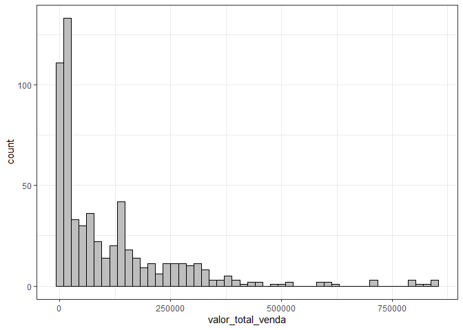
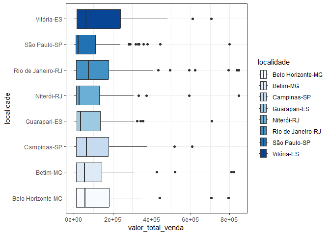

<!-- README.md is generated from README.Rmd. Please edit that file -->

# curso-gp-04-entrada-de-dados

<!-- badges: start -->
<!-- badges: end -->

# Exercicios

Carregando os pacotes

``` r
library(tidyverse)
```

Selecionando os arquivos que começam com um número e terminam com
“.xlsx”

``` r
lista_relatorios <- list.files("data-raw",
           full.names = TRUE,
           recursive = TRUE,
           pattern = "^[0-9].*xlsx$")
lista_relatorios
#> [1] "data-raw/03 - Relatório ES.xlsx" "data-raw/03 - Relatório MG.xlsx"
#> [3] "data-raw/03 - Relatório RJ.xlsx" "data-raw/03 - Relatório SP.xlsx"
```

observe que a expressão regular `^[0-9].*xlsx$` é usada para
corresponder a nomes de arquivos que começam com um dígito e terminam
com a extensão “.xlsx”.

`^`: Indica o início da linha. Garante que a correspondência comece
desde o primeiro caractere da linha. `[0-9]`: Corresponde a qualquer
dígito de $0$ a $9$. Isso significa que o primeiro caractere do texto
deve ser um dígito.

`.*`: Corresponde a zero ou mais ocorrências de qualquer caractere,
permitindo que qualquer sequência de caracteres siga o dígito inicial.

`xlsx`: Literalmente corresponde à sequência de caracteres “xlsx”.

`$`: Indica o final da linha. Garante que “xlsx” seja o final do texto.

Agora podemos carregar os arquivos, utilizando a função `map`, a lista
de arquivos e a função read_xlsx do pacote readxl (`readxl::read_xlsx`).

``` r
dados <- map_df(lista_relatorios, readxl::read_xlsx) %>% 
  janitor::clean_names()
```

A função “clean_names()” do pacote “janitor” limpa e padroniza os nomes
das colunas, retirando acentuações, caracteres especiais e passando as
letras para todas em minúsculas, substitui espaços por underscores e
garante que todos os nomes de colunas sejam únicos.

## 1- Qual a lista de Clientes dessa empresa?

``` r
dados %>% distinct(nome_cliente)
#> # A tibble: 8 × 1
#>   nome_cliente  
#>   <chr>         
#> 1 Ricardo Eletro
#> 2 Casas Bahia   
#> 3 Amazon        
#> 4 Kabum         
#> 5 Magazine Luiza
#> 6 Carrefour     
#> 7 Shoptime      
#> 8 Ponto Frio
```

## 2- Qual a lista de Vendedores por Localidade?

``` r
dados %>% 
  group_by(centro_distribuicao ) %>% 
  distinct(nome_representante) %>% 
  arrange(centro_distribuicao)
#> # A tibble: 18 × 2
#> # Groups:   centro_distribuicao [2]
#>    centro_distribuicao nome_representante
#>    <chr>               <chr>             
#>  1 São Paulo           Maria Silva       
#>  2 São Paulo           Felipe Seixas     
#>  3 São Paulo           Paulo Ferreira    
#>  4 São Paulo           Lucas Souza       
#>  5 São Paulo           Tais Fernandes    
#>  6 São Paulo           Mário Junior      
#>  7 São Paulo           Isabela Carolina  
#>  8 São Paulo           Teobaldo Junior   
#>  9 São Paulo           Alex Souza        
#> 10 minas gerais        Isabela Carolina  
#> 11 minas gerais        Maria Silva       
#> 12 minas gerais        Mário Junior      
#> 13 minas gerais        Felipe Seixas     
#> 14 minas gerais        Alex Souza        
#> 15 minas gerais        Paulo Ferreira    
#> 16 minas gerais        Teobaldo Junior   
#> 17 minas gerais        Tais Fernandes    
#> 18 minas gerais        Lucas Souza
```

## 3- Qual produto mais vendido por estado?

Listando as localidades

``` r
dados %>% 
  pull(localidade) %>% 
  unique()
#> [1] "Vitória-ES"        "Guarapari-ES"      "Belo Horizonte-MG"
#> [4] "Betim-MG"          "Niterói-RJ"        "Rio de Janeiro-RJ"
#> [7] "Campinas-SP"       "São Paulo-SP"
```

Substituindo o nome da localidade no filter, para encontrar os mais
vendidos em cada localidade.

``` r
dados %>% 
  filter(localidade =="São Paulo-SP") %>% 
  group_by(nome_produto) %>% #agrupo por produto
  summarise(
    total_vendido = sum(quantidade_vendida) #soma por produto
  ) %>% 
  arrange(desc(total_vendido)) %>% #ordena dados do maior para o menor total vendido
  slice(1) # Seleciona a primeira linha do data frame.
#> # A tibble: 1 × 2
#>   nome_produto total_vendido
#>   <chr>                <dbl>
#> 1 Caixa de Som           774
```

## 4- Criar histograma para valor total de vendas.

``` r
dados %>% 
  ggplot(aes(x = valor_total_venda)) +
  geom_histogram(bins = 50, 
                 color = "black",
                 fill="grey") + 
  theme_bw()
```

<!-- -->

## 5 - Criar o boxplot por Localidade

``` r
dados %>% 
  ggplot(aes(x = valor_total_venda, y = localidade, fill = localidade)) +
  geom_boxplot() + 
  theme_bw() +
  scale_fill_brewer()
```

<!-- -->

## 6 - Criar o Gráfico de TOTAL DE VENDAS por ESTADO (desafio)
